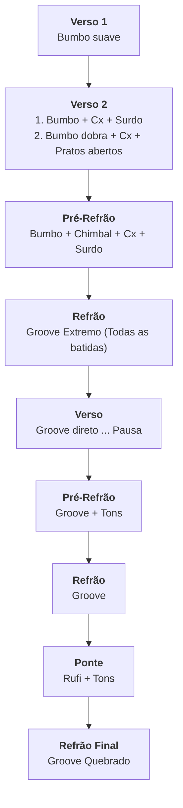
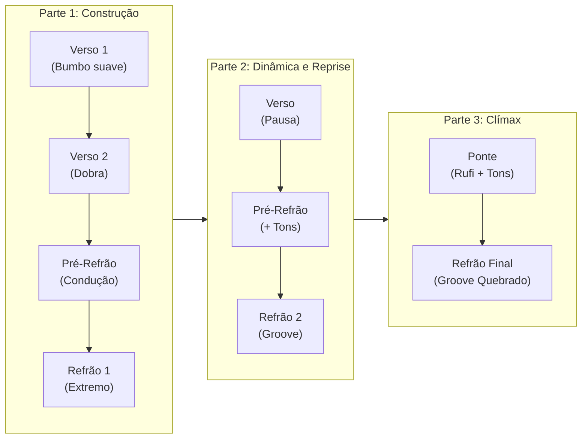
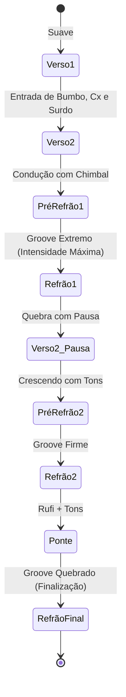

# Meia Noite - Estrutura Musical e Dinâmica

---

## 1. Roteiro Sequencial da Bateria (Flowchart)

---

## 2. Visão em Blocos por Fases (Horizontal)

---

## 3. Mapa de Transição e Intensidade (State Diagram)

